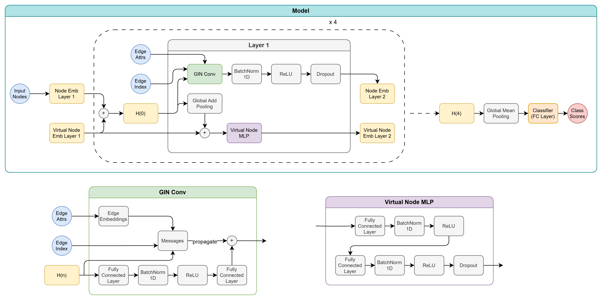

# noisy-graph-classification

Repository of the team "OopsAllNoise" (members: Matteo Pannacci 1948942, Emiliano Paradiso 1940454) for the Exam Hackaton "[GraphClassificationNoisyLabels](https://huggingface.co/spaces/examhackaton/GraphClassificationNoisyLabels)" done for the course of "Deep Learning" during the MSc in Artificial Intelligence and Robotics at Sapienza University of Rome, A.Y. 2024-2025.

## Method Overview

The project is based on the provided [baseline repository](https://github.com/Graph-Classification-Noisy-Label/hackaton/tree/baselineCe). In our work we implemented and tried different loss functions (SymmetricCrossEntropy, NCOD, GeneralizedCrossEntropy and a customized NoisyCrossEntropy function), we investigated a pretrain the models using all the datasets and then fine-tuning them on the desired one (which didn't obtain noticeable improvements), we added and tuned some hyperparameters (e.g. JK (JumpingKnowledge), message aggregation strategy, label smoothing). Finally we implemented a ensemble strategy where at testing time we exploit the knowledge of different models to compute our predictions.

The architecture used is the same for all datasets. We use a 4-layer Graph Isomorphism Network (GIN) with a node embedding size of 512 and with virtual nodes. The model is regularized using a strong dropout ratio (0.5) and adopting a weight decay of 1e-5 in the optimizer.

Predictions on the test datasets are computed using ensembles of models. The models are trained with different random seeds and different train/validation splits of the provided train dataset. In particular for datasets A and D we used 3-models ensembles where each model contributes to the vote with its softmax scores while for datasets B and C we used 7-models ensembles with a majority-voting strategy.

## Command-line Arguments

List and brief description of the arguments that can be provided to the model.

    # General
    --train_path (str): path to the training dataset (without this it's test-only)
    --test_path (str): path to the test dataset (mandatory)
    --val_proportion (float, 0.0): proportion of the train set to use for the validation set
    --num_checkpoints (int): number of checkpoints to save during training
    --device (int, 1): which gpu to use if any
    --seed (int, 42): random seed
    --save_all_best (bool, False): save the model each time it has the highest accuracy
    --from_pretrain (bool, False): start the training from the "model_pretrain_best.pth" in the /checkpoints folder
    --predict_with_ensemble (bool, True): predict using the models from the ensemble folder

    # Architecture
    --gnn_type (str, 'gin'): GNN_conv type, 'gin' or 'gcn'
    --virtual_node (bool, True): use virtual node
    --residual (bool, False): use residual connection
    --drop_ratio (float, 0.5): dropout ratio for each edge in the GNN
    --num_layer (int, 5): number of GNN message passing layers
    --emb_dim (int, 300): dimensionality of hidden units in GNNs
    --graph_pooling_type (str, 'mean'): type of pooling for the overall graph representation
    --jk (str, 'last'): aggregation type along layers for the node representation, 'last' or 'sum'
    --aggr_type (str, 'add'): aggregation type for the node message passing, 'add' or 'mean'
    
    # Training
    --lr (float, 0.001): optimizer learning rate
    --batch_size (int, 32): input batch size for training
    --epochs (int, 10): number of epochs to train
    --optimizer_type (str, 'adam'): optimizer name, 'adam' or 'adamw'

    # Loss
    --loss_type (int, 1): [1]: CrossEntropy; [2]: NoisyCrossEntropy; [3] SymmetricCrossEntropy; [4] NCOD; [5] GeneralizedCrossEntropy; [6] NoisyCrossEntropyCustom
    --noise_prob (float, 0.2): parameter p for NoisyCrossEntropy and NoisyCrossEntropyCustom
    --weight_decay (float, 0.0): weight decay regularization
    --use_class_weights (bool, False): use class weights in the loss computation
    --q (float, 0.5): q parameter for GeneralizedCrossEntropy
    --alpha (float, 1.0): alpha parameter for SymmetricCrossEntropy
    --beta (float, 1.0): beta parameter for SymmetricCrossEntropy
    --label_smoothing (float, 0.0): label smoothing regularization
